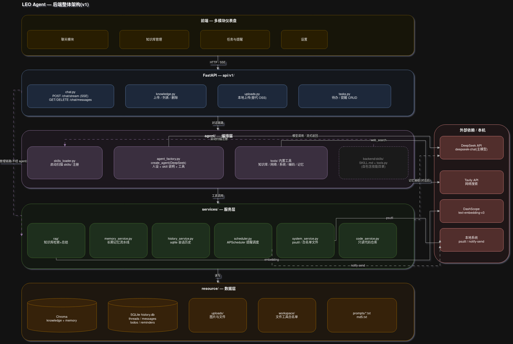

# LEO Agent

个人 AI 管家—— 用于学习 agent 全栈开发,兼顾个人日常使用。

## 能力域

| 能力 | 说明 |
|---|---|
| 个人知识库 | txt/pdf 上传入库(Chroma + DashScope embedding),对话中检索总结 |
| 系统琐事 | 有界工具集:系统信息、白名单目录文件操作、待办、定时提醒(**无任意命令执行**) |
| 交流对话 | DeepSeek 驱动的流式(SSE)对话;sqlite 会话历史 + 向量长期记忆 |
| 协助编码 | 只读代码工具:读取/搜索白名单项目目录 |

## 架构



- 完整设计文档:[docs/superpowers/specs/2026-08-31-agent-architecture-design.md](docs/superpowers/specs/2026-08-31-agent-architecture-design.md)
- draw.io 源文件:`docs/leo-agent-architecture.drawio`
- 产品构思:`PDD.md`

**核心原则:编排层薄、服务层厚。** 请求链路:API(`api/v1/`)→ 编排层(`agent/`,create_agent + skills 注入)→ 服务层(`services/`)→ 数据层(`resource/`)。管理类操作(知识库上传/待办/提醒)不经 agent,API 直达 service。

## 技术栈

| 端 | 技术 |
|---|---|
| 后端 | Python 3.13 · FastAPI · LangChain(create_agent)· Chroma · SQLite · APScheduler · pixi |
| 模型/外部服务 | DeepSeek(主模型)· DashScope(embedding)· Tavily(网络搜索) |
| 前端 | React 19 · Vite 7 · TypeScript · Tailwind CSS 4 · shadcn/ui · TanStack Query |

## 目录结构

> 🆕 = 骨架占位(仅 docstring,无实现);⏳ = 计划中尚未开始

```
.
├── backend/
│   ├── main.py                  # FastAPI 入口(现有)
│   ├── config.json              # agent/RAG/prompts 配置(现有)
│   ├── pixi.toml                # 环境与依赖(pixi 管理)
│   ├── api/v1/                  # 路由层
│   │   ├── chat.py              # 聊天端点(现有,待 M2 实现)
│   │   ├── oss.py               # OSS 预签名(现有,计划 M5 移除)
│   │   ├── knowledge.py         # 🆕 知识库上传/列表/删除
│   │   ├── uploads.py           # 🆕 本地上传(替换 OSS)
│   │   └── tasks.py             # 🆕 待办/提醒 CRUD
│   ├── agent/                   # 编排层(薄)
│   │   ├── tools.py             # 现有工具(计划 M0 拆分)
│   │   ├── middlewares.py       # 现有(空)
│   │   ├── agent_factory.py     # 🆕 create_agent 组装
│   │   ├── skills_loader.py     # 🆕 skills 扫描注册
│   │   └── tools/               # 🆕 按域拆分:knowledge/web/system/coding/memory
│   ├── services/                # 🆕 服务层(厚)
│   │   ├── memory_service.py    # 长期记忆流水线
│   │   ├── history_service.py   # sqlite 会话历史
│   │   ├── scheduler.py         # APScheduler 提醒调度
│   │   ├── system_service.py    # psutil / 白名单文件操作
│   │   └── code_service.py      # 只读代码仓库操作
│   ├── rag/                     # 现有(计划 M0 迁入 services/rag/)
│   ├── common/                  # 现有:配置/路径/prompt/日志/文件工具
│   ├── models/                  # 现有:Pydantic 请求模型
│   ├── resource/                # 运行时数据
│   │   ├── chroma_db/           # 现有:Chroma 向量库
│   │   ├── history/             # 现有:会话记忆(空)
│   │   ├── prompts/             # 现有:system/summarise prompt
│   │   ├── md5.txt              # 现有:入库去重清单
│   │   ├── uploads/             # 🆕 上传文件存储
│   │   └── workspace/           # 🆕 文件工具白名单目录
│   ├── skills/                  # 现有(空):技能目录,M4 落示例 skill
│   ├── tests/                   # 🆕 pytest 测试
│   └── static/                  # 教程残留占位(将被前端构建产物替换)
├── frontend/                    # React 模板(现有,尚未对接后端)
├── docs/
│   ├── superpowers/specs/       # 架构设计文档
│   └── leo-agent-architecture.drawio
├── assets/                      # 文档图片
├── PDD.md                       # 产品设计文档
└── CLAUDE.md                    # 仓库工作指引
```

## 快速开始

### 环境变量

仓库根目录 `.env`(gitignored,`.env.example` 为模板):

```
DASHSCOPE_API_KEY=...    # embedding
DEEPSEEK_API_KEY=...     # 主模型
OPEN_AI_KEY=...
TAVILY_API_KEY=...       # 网络搜索
OSS_*                    # 计划移除(M5)
```

### 后端

```bash
cd backend && pixi install

# 启动 API(127.0.0.1:8001)—— 必须从仓库根目录运行,`backend.*` 导入才能解析:
pixi run --manifest-path backend/pixi.toml python -m backend.main

# 知识库入库(命令行,txt/pdf,md5 去重):
python -m backend.rag.vector_store
```

### 前端

```bash
cd frontend && npm install
npm run dev        # :5173,直连 :8001(暂无 vite proxy)
npm run check      # lint + format + typecheck
npm run test:run   # 测试
```

## 开发状态

| 里程碑 | 状态 |
|---|---|
| 架构设计(spec)+ 架构图 | 完成 |
| 目录骨架 | 设计中 |
| M0 地基修复(config/迁移/导入/pytest) | 未完成 |
| M1 数据层(sqlite + services) | 未完成 |
| M2 最小闭环(SSE 流式对话) | 未完成 |
| M3 能力扩展(工具挂载 + 长期记忆) | 未完成 |
| M4 skills 机制 + 提醒调度 | 未完成 |
| M5 收尾(本地上传替代 OSS) | 未完成 |

## 约定

- 后端注释中文;前端代码与注释英文(以所在文件为准)
- Python 一律从仓库根目录运行(`backend.` 包前缀)
- 提交格式:conventional 单行,无 emoji、无 trailer —— `frontend/CLAUDE.md` 中的仓库级规则
- 后端无测试框架 → 计划引入 pytest(`backend/tests/`)

## 文档索引

- [CLAUDE.md](CLAUDE.md) — 仓库工作指引(命令、架构、约定)
- [frontend/CLAUDE.md](frontend/CLAUDE.md) — 前端规范(组件风格、命名、commit 格式,仓库级)
- [PDD.md](PDD.md) — 产品设计文档
